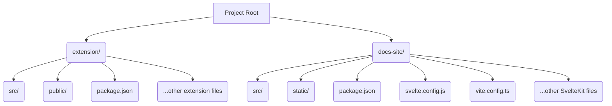

# Documentation Website Plan

This document outlines the plan for creating a dedicated documentation website for the Fact Checker Chrome Extension.

## 1. Project Restructuring

*   Create two new top-level folders: `extension/` and `docs-site/`.
*   Move all current project files and folders (except `.git`, `.clinerules`, `README.md` if it's general, etc.) into the `extension/` directory. This isolates the extension code.
*   The new documentation website will reside entirely within `docs-site/`.

## 2. Initialize Documentation Site (`docs-site/`)

*   Use `bunx create-svelte docs-site` to scaffold a new SvelteKit project. Select Svelte 5, Skeleton project template, and TypeScript during setup.
*   Install necessary dependencies: `cd docs-site && bun install && bun add -D @tailwindcss/typography @skeletonlabs/skeleton @skeletonlabs/tw-plugin`.
*   Configure Tailwind CSS and Skeleton UI according to their setup guides.

## 3. Content Structure & Internationalization (i18n)

*   **Routing:** Create pages for key sections:
    *   `/` (Introduction)
    *   `/installation` (Web Store, Developer Mode)
    *   `/configuration` (API Endpoints, API Keys, Ollama)
    *   `/usage` (Selecting Text/Images)
*   **i18n:**
    *   Set up `typesafe-i18n` within `docs-site/` to handle translations.
    *   Create translation files for supported languages (de, en, es, fr, pt) under `docs-site/src/i18n/`.
    *   Implement a language switcher component.

## 4. Page Content

*   **Introduction:** Explain the extension's purpose and the importance of critical evaluation.
*   **Installation:**
    *   Provide a direct link to the Chrome Web Store.
    *   Explain the developer mode installation:
        1.  Navigate to the `extension/` directory in the terminal.
        2.  Run `bun run build`.
        3.  Locate the generated `dist.zip` file.
        4.  Go to `chrome://extensions/`, enable "Developer mode", click "Load unpacked", and select the *unzipped* `dist` folder.
*   **Configuration:**
    *   Explain adding API endpoints using the extension's UI.
    *   **API Keys:** Advise users to consult official documentation for providers (Gemini, OpenAI, etc.) to obtain keys.
    *   **Ollama:** Link to official Ollama setup guides. Instruct users to add their local Ollama URL (e.g., `http://localhost:11434`) as a new endpoint in the extension.
*   **Usage:** Detail how to select text or images on a webpage for fact-checking.
*   **Styling:** Utilize Skeleton UI components and Tailwind CSS for a clean, modern look, potentially including a dark mode toggle.

## 5. Next Steps

*   Refine the content details and layout for each page.
*   Consider adding screenshots or short GIFs to illustrate steps.
*   Set up a build process for the static site (e.g., using SvelteKit's `adapter-static`).