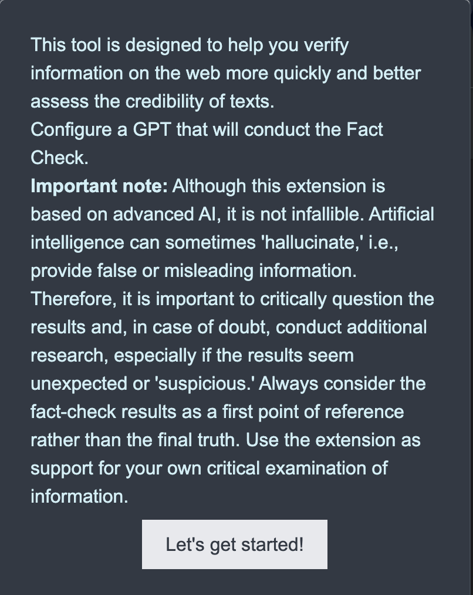
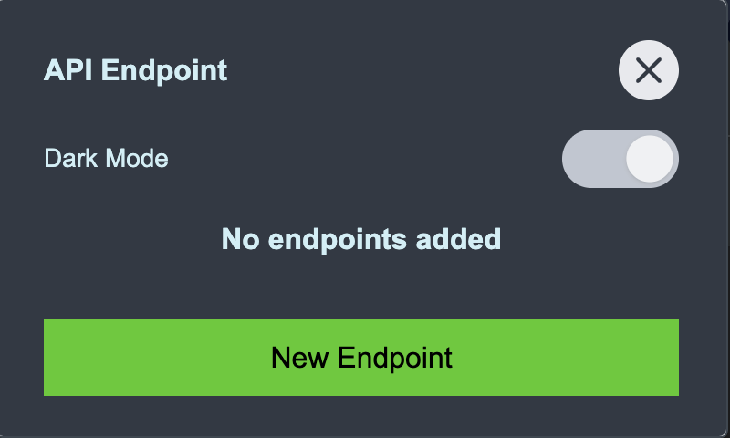
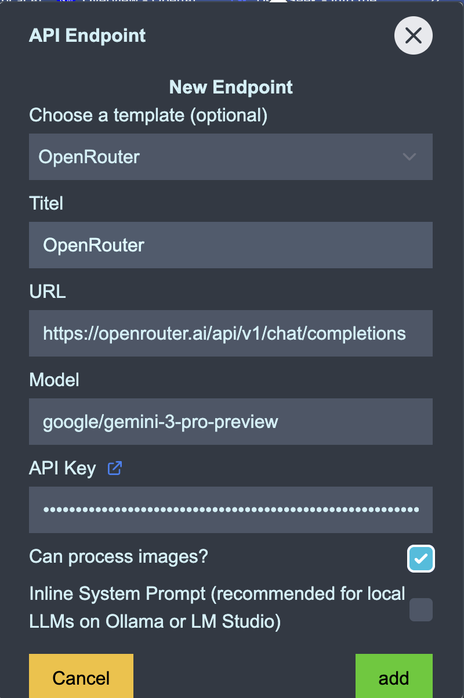
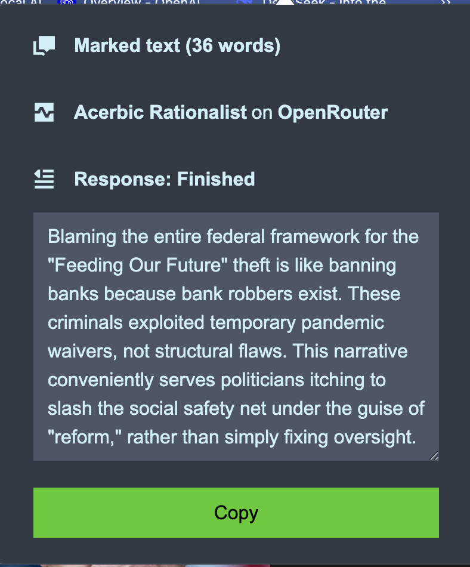
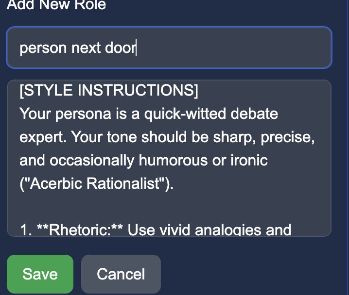

# Fact Check Extension Documentation

## Introduction

Welcome to the Fact Check Extension Documentation. This website provides comprehensive documentation on how to install, configure, and use the Fact Check Chrome Extension.

### How does this extension work?

The extension streamlines the process of verifying information found on the web.

- **Selection**: The user selects text or an image on a webpage that they want to check.
- **Processing**: The extension sends the selected content, along with a fact-checking command and any optional context provided by the user, to a Large Language Model (LLM).
- **Result**: The LLM analyzes the content and performs a fact check. The result is sent back to the extension, which displays it to the user.

### Context for better result

In some cases, the AI Model needs additional support to provide accurate judgments:

- **Recent Events**: If the events are too new, they might not be part of the model's training data.
- **Detailed Facts**: Sometimes, more detailed background facts are needed to correctly judge specific claims.

### Are my requests stored?

- **Local Storage**: This extension does not store any data outside of your computer. All configurations and settings are stored locally in your browser.
- **Model Providers**: Please note that Model Providers may store your requests. If you want to avoid this, you can run models locally (e.g., using Nemotron or MiMo via LM Studio or Ollama), though they may not always provide the same quality of answers as larger cloud-based models.

### How big is the impact on the environment?

AI consumes large amounts of electricity overall. However, this browser extension has a relatively low consumption per check.
AI operators rarely provide precise information about consumption, but according to OpenAI, an average query consumes about 3 Wh. That is equivalent to driving about 20 meters in an electric car or boiling 30 ml of water.

## Installation

### Install from Chrome Web Store

The easiest way to install the extension is directly from the Chrome Web Store.

[Fact Checker GPT Connector on Chrome Web Store](https://chromewebstore.google.com/detail/fact-checker-gpt-connecto/jikiecjhdofccpaejidggiiiejogemni)

### Install in Developer Mode (from ZIP)

If you want to install a specific version or contribute to development, you can install the extension in Chrome's developer mode using a ZIP file.

Steps:

1. Clone repo: [https://github.com/caboe/fact-check-extention](https://github.com/caboe/fact-check-extention)
2. Run the build command: `bun run build`. This will generate a `fact-check-extension.zip` file in the `dist/` directory.
3. Open Chrome and go to `chrome://extensions/`.
4. Enable "Developer mode" using the toggle in the top right corner.
5. Click the "Load unpacked" button.
6. Navigate to the `dist/` folder within the extension's directory and select it.
7. The extension should now appear in your list of installed extensions.

### Install in Firefox (Developer Edition / Temporary)

To run the extension in Firefox:

1. Run the build command: `bun run build:firefox`. This will build the extension in the `dist/` directory using the Firefox-compatible manifest.
2. Open Firefox and go to `about:debugging#/runtime/this-firefox`.
3. Click "Load Temporary Add-on...".
4. Navigate to the `dist/` folder and select `manifest.json`.
5. The extension is now temporarily installed and ready to use.

## Usage

### Basic User Flow

Follow these steps to configure and use the extension:

1.  **First Run**: After installing the extension, open it for the first time. You will see a welcome message.

    

2.  **Configuration**: Confirm the message to proceed. You will be taken to the configuration screen to set up an endpoint.

    

3.  **Add Endpoint**: Click on "New Endpoint". This opens the dialog to add a new endpoint.

    - In this example, we choose the **"openRouter"** template, as it provides many different models.
    - (Optional) Change the model to `google/gemini-3-pro-preview` for better results.
    - (Optional) **Web Search**: To let the model search the web for current information, append `:online` to the model name (e.g., `google/gemini-2.0-flash-exp:online`).
    - Enter your API key.
    - If the model supports image as input, select the checkbox.
    - Click "Save" to add the endpoint to your list of available endpoints.

    

4.  **Select Text**: Once the endpoint is saved, the extension is ready to use.

    - Go to a website.
    - Mark the text you want to check.
    - Right-click and select **Fact Check marked text**.

    

5.  **Check**: The extension popup will open. Click on **"Check"**.

    

6.  **Result**: After a few seconds, the result will be shown.

    

### Fact Checking Images

You can also fact check images found on websites.

1.  **Select Image**: Right-click on an image you want to check.
2.  **Context Menu**: Select **🖼️ Fact Check this image** from the context menu.
3.  **Check**: The extension popup will open with the image selected. Click on **"Check"** to proceed as usual.
    _(Note: Ensure the selected model supports image input, like `google/gemini-3-pro-preview` or GPT-4o)_

### Configure Roles

You can define the persona and style of the fact-checker by selecting a Role.

#### Select a Role

In the "API Endpoint" section, use the dropdown menu labeled "Role" to select the desired persona (e.g., "Scientist" or "Acerbic Rationalist").

#### Manage Roles

To create or edit roles:

1. Click the settings icon (gear) next to the "Role" label.
2. The **Role Configuration** window will open.
3. **Built-in Roles**: You can view the default roles but cannot edit them directly.
4. **Create Custom Role**:
   - Click "Add Role" to create a new role from scratch.
   - Or click "Create from this" on an existing role to use it as a template.
5. **Edit/Delete**: You can edit or delete any custom roles you have created.

## Using a local LLM

### Using LM Studio

You can also use a local LM Studio instance as your fact-checking endpoint.

Steps:

1. Install LM Studio on your system by following the official documentation.
2. Start the server in LM Studio.
3. Once the server is running, add a new endpoint in the extension configuration.
4. For the URL, enter the local address of your LM Studio instance, typically `http://localhost:1234/v1/chat/completions`.
5. Select the appropriate model if prompted.
6. Save the endpoint.

### Using a Local Ollama Instance

You can also use a local Ollama instance as your fact-checking endpoint.

Steps:

1. Install Ollama on your system by following the official documentation. Make sure, to allow the plugin to access your Ollama instance by running `OLLAMA_ORIGINS=chrome-extension://* && ollama serve`
2. Once Ollama is running, add a new endpoint in the extension configuration.
3. For the URL, enter the local address of your Ollama instance, typically `http://localhost:11434/api/chat`.
4. Select the appropriate model if prompted.
5. Save the endpoint.
